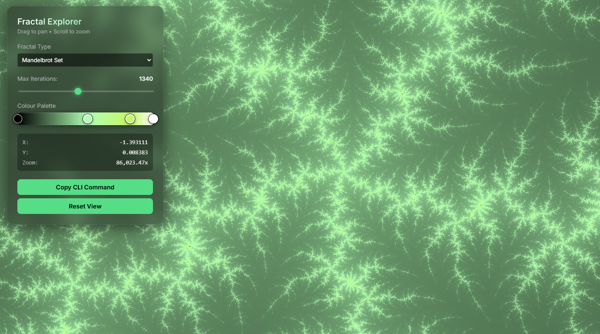
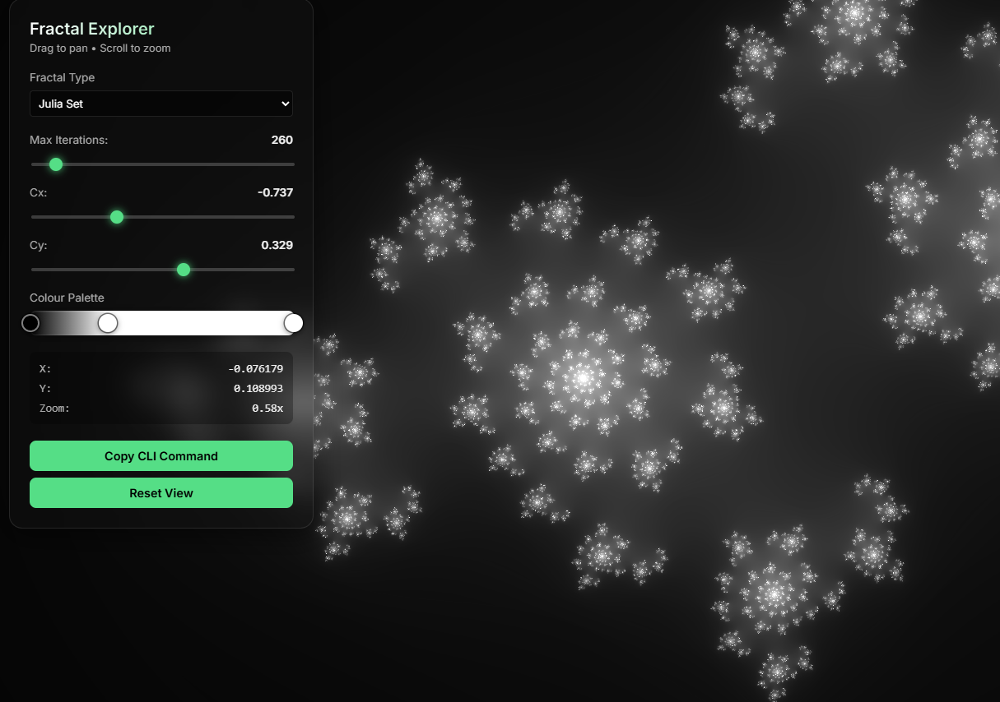

# CppFractals Explorer

An ultra-fast, CUDA-accelerated C++ application for generating beautiful Mandelbrot set images, coupled with a pristine, modern web-based UI for effortless exploration of the complex plane.

---

## Features

**Core C++ Generator:**
- Generates fractal images in the complex plane utilizing lightning-fast CUDA parallel processing.
- Outputs high-resolution PNG images natively (using `stb_image_write.h`).
- Highly customizable parameters: width, height, maximum iterations, coordinates, and zoom limits.

**Web Explorer UI:**
- **Zero-Latency Navigation:** Highly responsive exploration utilizing GPU-accelerated CSS transforms.
- **Interactive Controls:** Seamless click-and-drag panning, and precise scroll-to-zoom tracking your mouse cursor natively.
- **Glassmorphic Design:** A beautiful, responsive dark-mode overlay to manipulate generation limits instantly.

---

## Requirements

### To Build the Core C++ Engine
- **Visual Studio 2019 or later** (or another C++17-compatible compiler)
- NVIDIA GPU with **CUDA Toolkit** installed
- No external dependencies except [`stb_image_write.h`](https://github.com/nothings/stb) (included).

### To Run the Web UI
- **Node.js** (v14+ recommended)
- **npm** (included with Node.js)

---

## Getting Started

### 1. Build the C++ Backend
1. Clone or download this repository.
2. Open `CppFractals.sln` in Visual Studio.
3. Ensure your build configuration is set to **Release** and **x64**.
4. Build the solution (`Build → Build Solution` or press **Ctrl + Shift + B**). This compiles `CppFractals.exe` into the `x64\Release` folder.

### 2. Run the Web Interface
Once the executable is built, you can spin up the web explorer:

1. Open your terminal in the root directory of this project (`CppFractals`).
2. Install the necessary Node.js dependencies:
   ```bash
   npm install express
   ```
3. Start the server:
   ```bash
   node server.js
   ```
4. Open your web browser and navigate to:
   **`http://localhost:3000`**

---

## Command Line Usage (Advanced)

If you prefer generating standalone files via CLI without the web UI, you can call the compiled executable directly.

```bash
x64\Release\CppFractals.exe <width> <height> <maxIterations> <modifier> <xCenter> <yCenter> <zoomFactor> <outputFilename>
```

**Example:**
```bash
x64\Release\CppFractals.exe 3840 2160 400 2.0 -1.4002 0.0 0.10 my_mandelbrot.png
```

---

## Example Output



