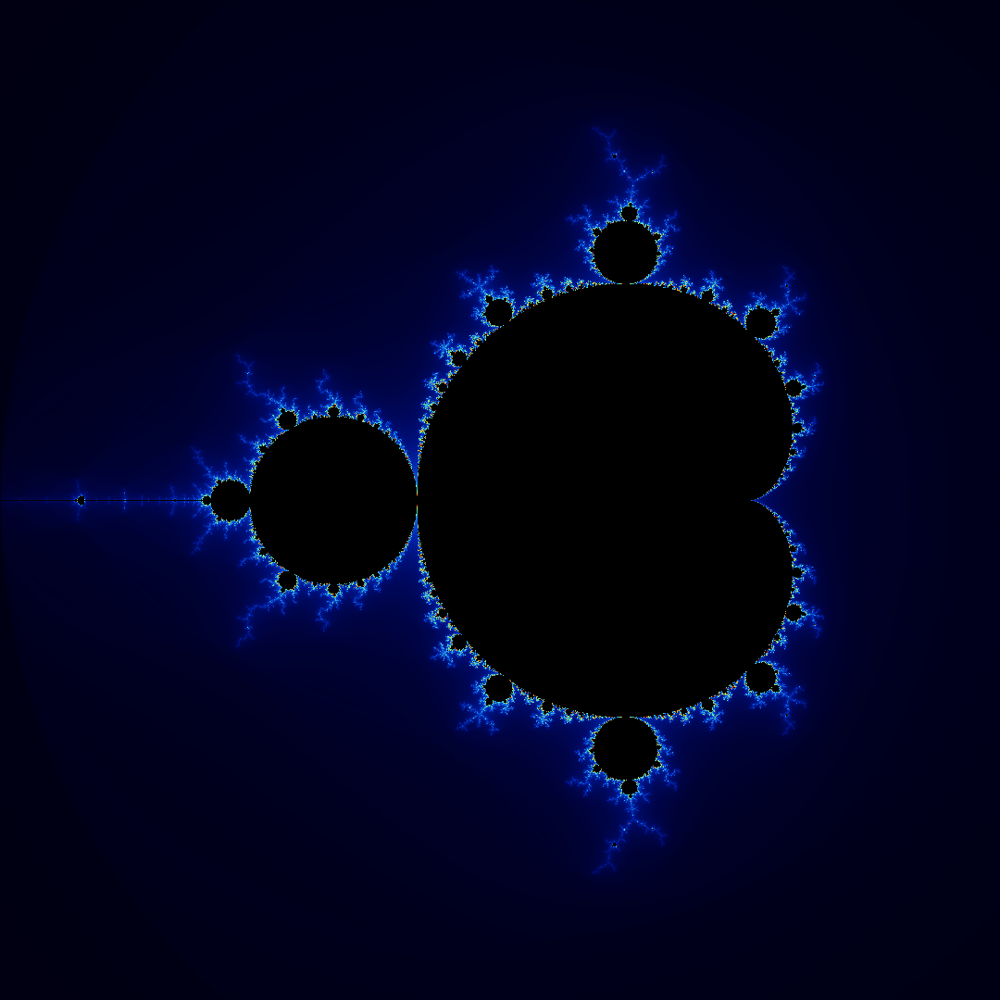

# CppFractals

✨ A simple C++ application that generates beautiful fractal images (Mandelbrot set) and saves them as PNG files.

---

## Features

- Generates Mandelbrot fractal images in the complex plane.
- Allows customizing image resolution and iteration limits.
- Outputs PNG images (using `stb_image_write.h`).

---

## Requirements

- **Visual Studio 2019 or later** (or another C++17-compatible compiler).
- C++17 standard or higher.
- No external dependencies except [`stb_image_write.h`](https://github.com/nothings/stb).

---

## Building

### Using Visual Studio

1. Clone or download this repository.

2. Open `CppFractals.sln` in Visual Studio.

3. Make sure your configuration is set (e.g., Debug/Release and x64 or Win32).

4. Build the solution (`Build → Build Solution` or press **Ctrl + Shift + B**).

5. Run the application (`Debug → Start Without Debugging` or press **Ctrl + F5**).

---

## Usage

When you run the program:

- It will generate a fractal image using default parameters (e.g., 800×600 resolution and max iterations = 1000).
- The image will be saved in the executable directory as `output.png`.

You can adjust parameters such as image width, height, and maximum iterations in the `main.cpp` file if desired.

---

## Example Output



---

## How to customize

Edit `main.cpp` to set different regions or zoom levels in the complex plane.  
Example:

```cpp
int width = 1920;
int height = 1080;
int maxIterations = 1500;
